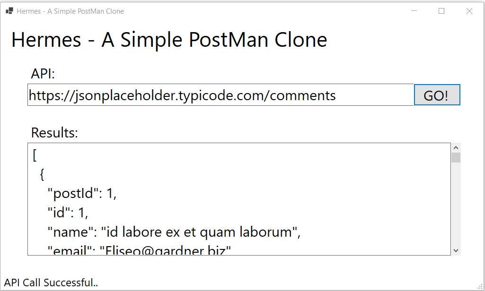
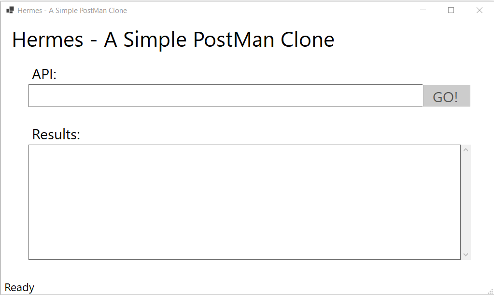

# Hermes 
*A Simple PostMan clone*

## Application Goal:
To build a Windows Form App, that is a clone of PostMan App.
It should be able to call a given API and display the results in text window.

## Used Technologies:
- Windows Forms
- Class Libraries
- HttpClient
- JSON
- Git
- GitHub

